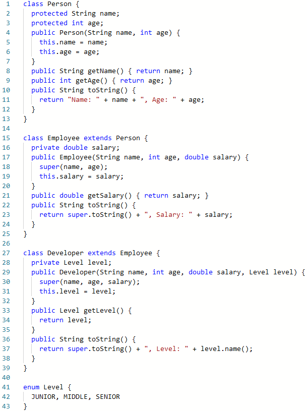
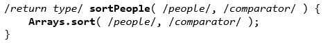

# JOM. Generics. Collections. Annotations
## Task 6

Suppose we have the next class hierarchy:

Create classes with name **PersonComparator**, **EmployeeComparator**, **DeveloperComparator** that implenent the **Comparator<Type>** generic interface.

In the **Utility** class create **public static** method named **sortPeople(...)** that takes an **array** of **Person** type and **derivative** from it types, and **comparator** as input, and returns the value of **void** type.

Also, as **second argument** the method **sortPeople(...)** can takes **generic comparator** for elements of **Object** type.

The **sortPeople(...)** method should sorted records by **ascending**. At first by **name**, then by **age**, then by **salary**, and then by **Level (JUNIOR < MIDDLE < SENIOR)**

As implementation of **sortPeople(...)** method use the next code:

> For correct passing of all tests don't use **print** and **println** methods in your code.
