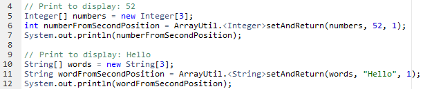

# JOM. Generics. Collections. Annotations
## Task 4

In the class **ArrayUtil** write a **public static** generic method named "**setAndReturn(...)**" to modify and return the element in an array from the given position.

Examples of usage:

> For correct passing of all tests don't use **print** and **println** methods in your code.
