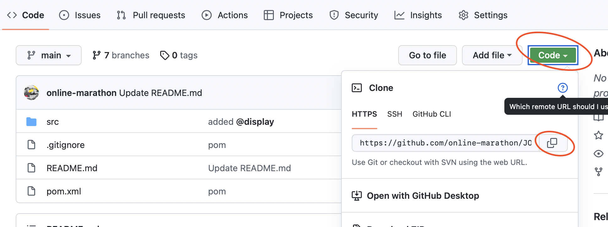

# Welcome to Java Marathon
## JOM. Generics. Collections. Annotations

You can start by cloning the repository to your computer using the following command:
```
git clone <url>
```
You can copy the Url here



This sprint contains a few tasks. Unit tests for the tasks are in the separate branches **task1**, **task2**, **task3**.... 

You can switch between branches using a command
```
 git checkout <branch name>
```
 e.g.
```
 git checkout task1
 ```
 > Don't forget to commit your code before switching to another branch
 
 In the **main** folder first you need to complete your code with the solution of the taks
 
After this uncomment all tests in folder **test** and run the code
```
mvn test
```
or (if you haven't installed Maven on your PC)
```
./mvnw test
```
or just use command `Run` from your IDE
 
