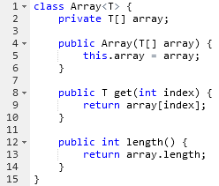
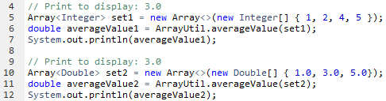

# JOM. Generics. Collections. Annotations
## Task 5

Suppose we have the next generic class:

In the class **ArrayUtil** write **static** method named "**averageValue(...)**" that takes an object of **Array** type as input, and returns the average value its elements.

The given method should returns value of **double** type and take any array, whose elements extends **Number** type.

Examples of usage:

> For correct passing of all tests don't use **print** and **println** methods in your code.
